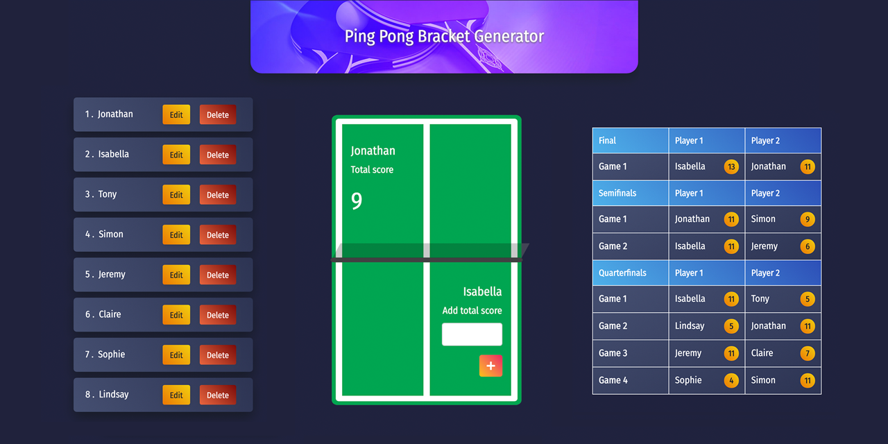
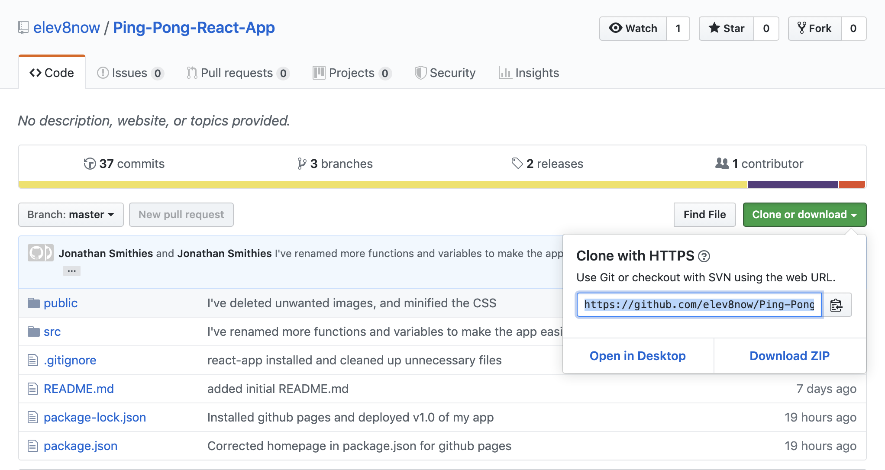
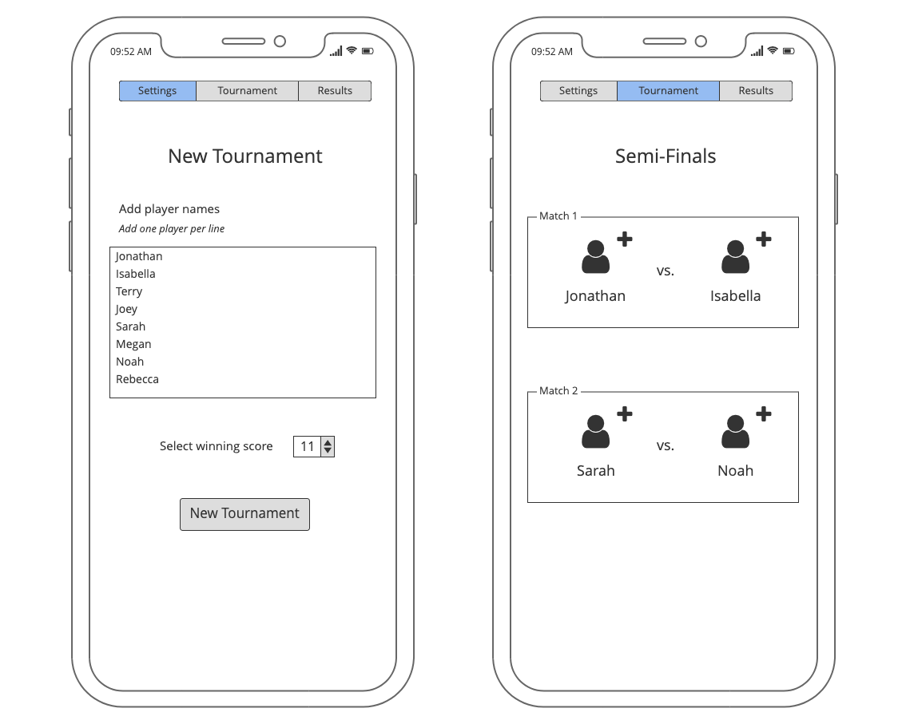
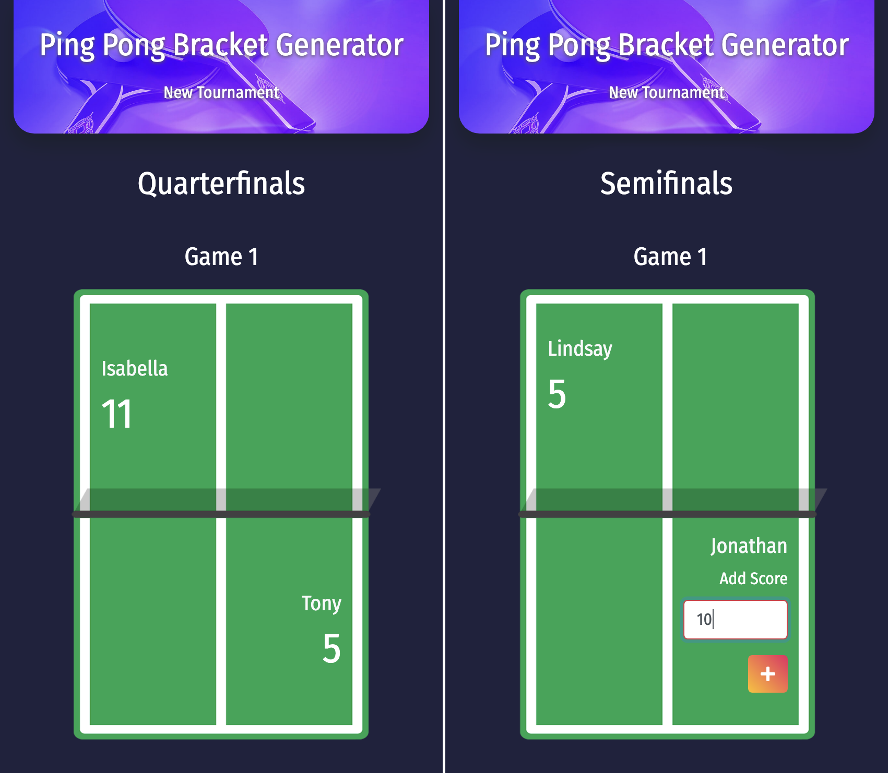
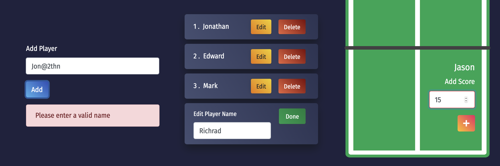
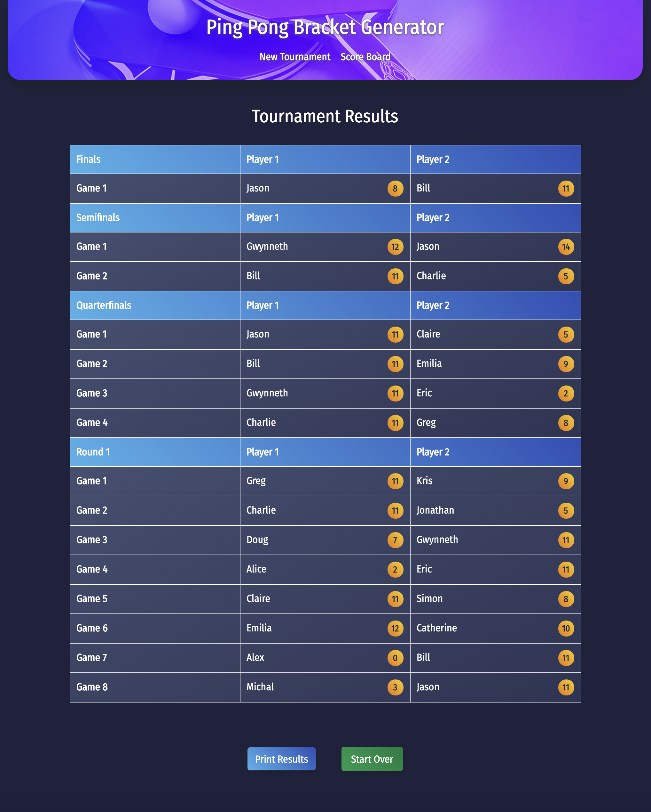

# Ping Pong Tournament Generator

### A showcase project for DevelopMe Coding Fellowship (Summer 2019)



## Introduction

This app is a tool which randomly creates pairings for a ping pong tournament bracket from a list of names collected from the user. 

### Technologies 

- JavaScript
- React
- Redux
- JSX
- HTML/CSS
- Bootstrap
- Git (version managed)

### App Features

- Edit / delete players 
- Validate player names
- Validate number of players  
- Choose your winning score (11 or 21)
- Play multiple rounds
- Generate random pairings 
- Save player scores
- Score comparison / validation 
- Intelligent round names e.g. semifinals
- Validate all scores to unlock next round
- Identify winners and generate next round of playoffs
- Scoreboard to view tournament results
- Print scoreboard option

## Setup on your machine 

### Prerequisites 

- Latest version of NPM installed on your machine (check your version with `npm -v`)
- Command Line (recommend Terminal or [iTerm](https://www.iterm2.com/) on macOS, or your preferred app)
- Code editor (recommend [VS Code](https://code.visualstudio.com/))
  
### Follow these steps

1. Open your terminal app, and navigate into the directory on your local machine where you want to store the app files

```shell 
$ cd ~/path/to/directory/
```

2. Open the GitHub repository link in your web browser and copy the SSH key



3. Run the following command in your terminal (remember to update the `app-name`): 

```shell
$ git clone git@github.com:elev8now/Ping-Pong-React-App.git app-name
```

4. Navigate into your new app directory 

```shell
$ cd app-name
```

5. Install the app dependencies 

```shell
$ npm install 
```

6. Initiate the app 

```shell 
$ npm start 
```

7. The app will launch in your default browser at http://localhost:3000/

## View the app online 

Open the live app in your browser with this link: https://elev8now.github.io/Ping-Pong-React-App/

## Wireframes

I used Balsamiq to generate these wireframes as a starting point for my development. 



## App previews

### Add players


### Play and score



### Validate input data



### View scoreboard




## Key functionality 

### Winners

The purpose of this function is to get back all the winners from an array that stores multiple games with 2 players in each and their respective scores. The next step is to shuffle and split the flat array to create a new round of games. 

```js
const winners = (games) => {
    let result = games.map(game => game.reduce((winner, player) => player.score > winner.score ? player : winner));
    return result;
};
``` 

### Shuffle 
The purpose of this function to shuffle an array. The application of this functon is to take an array of player objects and shuffle them into a random order. This function is based on the Fisher-Yates shuffle algorithm.

```js
const shuffle = array => {

    let index = array.length;
    let temp, random;

    while (index !== 0) {
        random = Math.floor(Math.random() * index);
        index -= 1;

        temp = array[index];
        array[index] = array[random];
        array[random] = temp;
    };

    return array;
};
```

### Split 

The purpose of this function to split an array into chunks. The application of this functon is to split an array of player objects into multiple games.

```js
const split = players => {
    let result = [];
    let teams = Math.floor(players.length / (players.length / 2));

    while (players.length) {
        result.push(players.splice(0, teams));
    }

    return result;
};
```

### Scoring

The scoring functionality is too complex to display here. To understand it, find and open [score.notes.js](./src/data/functions/score.notes.js) which explains everything. 

## Performance

The results of Chrome Dev Tools Lighthouse Audit 

